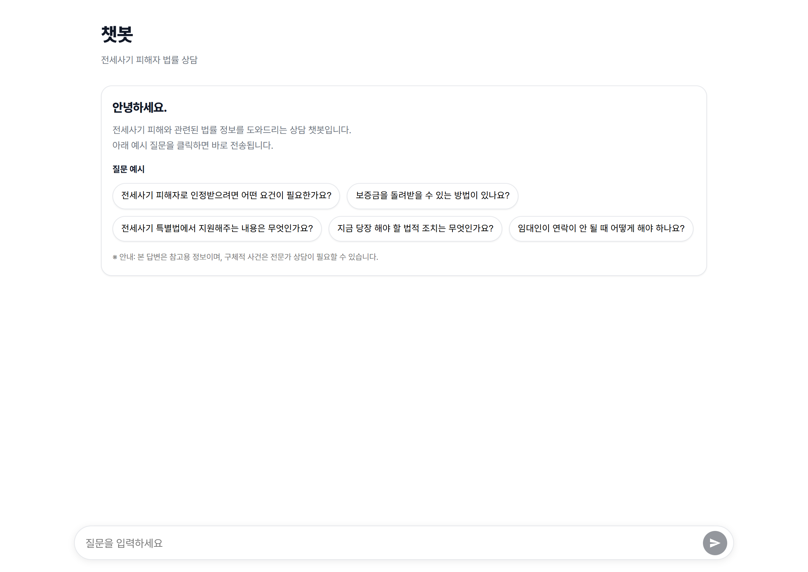
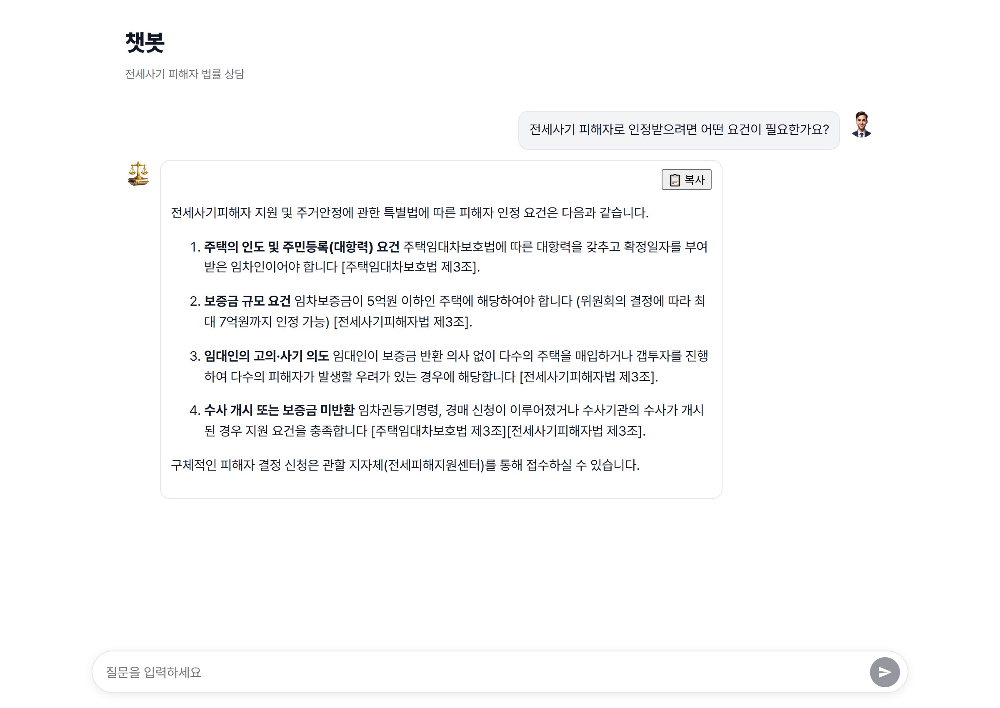

# 🏛️ 전세사기 피해자 법률 상담 AI 챗봇 (Chatbot Law – Production)

> **전세사기 피해자를 위한 법률·행정 절차 안내 AI 서비스**  
> 신뢰할 수 있는 법률 근거 기반 RAG(Retrieval-Augmented Generation) 파이프라인과 안정적인 클라우드 프로덕션 인프라를 갖춘 풀스택 서비스입니다.

[](https://github.com/youneedpython/chatbot-law-production/releases)
[](https://fastapi.tiangolo.com)
[](https://react.dev)
[](https://www.pinecone.io)
[](https://aws.amazon.com)

---

## 📖 목차
1. [프로젝트 소개](#-프로젝트-소개)
2. [해결하고자 하는 문제](#-해결하고자-하는-문제)
3. [프로젝트 핵심 장점](#-프로젝트-핵심-장점)
4. [서비스 화면 미리보기](#-서비스-화면-미리보기)
5. [핵심 기능 및 UX](#-핵심-기능-및-ux)
6. [시스템 아키텍처](#-시스템-아키텍처)
7. [기술 스택](#-기술-스택)
8. [운영 신뢰성 및 모니터링](#-운영-신뢰성-및-모니터링)
9. [프로젝트 로드맵](#-프로젝트-로드맵)
10. [상세 개발 및 사용 가이드 (Wiki)](#-상세-개발-및-사용-가이드-wiki)
11. [법적 고지 (Legal Disclaimer)](#-법적-고지-legal-disclaimer)

---

## 💡 프로젝트 소개

**Chatbot Law**는 전세사기 피해로 혼란을 겪는 임차인들에게 복잡한 법적 대응 절차, 관련 지원 제도, 필요 서류 및 관할 기관 정보를 신속하고 정확하게 전달하기 위해 제작된 AI 법률 상담 서비스입니다.

본 프로젝트는 단순한 LLM 데모나 프로토타입에 그치지 않고, **실제 프로덕션 환경에서의 고가용성, 무중단 배포, 요청 추적성(Observability), 그리고 법률 도메인 특화 RAG 신뢰성**을 만족하도록 설계되었습니다. 기능 단위 릴리즈와 안정화 패치 릴리즈를 명확히 구분하여 운영 기준선을 중심으로 점진적으로 확장되는 체계를 지향합니다.

---

## 🎯 해결하고자 하는 문제

1. **복잡하고 파편화된 법률 정보**
   - 전세사기 특별법, 주택임대차보호법, 민사집행법 등 여러 법률과 지원 센터 정보가 흩어져 있어 피해자가 즉각적인 대응 순서를 파악하기 어렵습니다.
2. **LLM의 법률 할루시네이션(환각) 방지**
   - 단정적인 잘못된 법적 조언은 2차 피해를 낳을 수 있습니다. 본 서비스는 **실제 법령 조항 메타데이터와 1:1 매핑된 앙커 인용(Anchor Token)**을 강제하여, 모든 답변의 출처를 투명하게 제시합니다.
3. **지속 가능한 운영 기준선(Dev/Prod Parity)**
   - 개발(Dev)과 운영(Prod) 환경의 불일치 문제를 해결하고, CI/CD 자동화 및 데이터베이스 마이그레이션(Alembic) 체계를 구축하여 안정적인 배포 주기를 유지합니다.

---

## 🌟 프로젝트 핵심 장점

### 1. 🛡️ 검증 가능한 고신뢰성 법률 RAG (Zero Hallucination)
- **법령 조·항·호 단위 메타데이터 인덱싱**: 일반 텍스트 분할이 아닌, 법률명(`law_title`), 조항(`article_no`, `article_title`), 항(`clause_no`) 단위의 정밀 메타데이터를 구축하여 검색 정확도를 극대화했습니다.
- **결정론적 앙커 토큰 인용 매핑**: 모델 답변 내 앙커 토큰(`⟦n⟧`)과 실제 근거 문서(REF) 번호를 1:1로 엄격히 결합하여, 프론트엔드에서 실제 조항명(`[전세사기피해자법 제3조]`)으로 인라인 치환 렌더링합니다.
- **추측 방지 가드레일**: 법적 근거가 부족한 경우 자의적 법률 해석이나 유추를 차단하고, 확인된 사실 및 기관 방문 절차만을 안내합니다.

### 2. 🚀 완벽한 프로덕션 지향 아키텍처 (Production-Ready)
- **정적/동적 오리진 완전 분리**: React SPA는 **AWS S3 + CloudFront CDN**을 통해 전 세계 엣지에서 초저지연으로 서빙되며, API는 **Elastic Beanstalk + ALB**로 로드밸런싱되어 트래픽 변동에 유연하게 대응합니다.
- **체계적인 데이터베이스 마이그레이션**: SQLite 수준의 프로토타입을 넘어 **AWS RDS(PostgreSQL)** 기반으로 구축되었으며, **Alembic**을 통해 DDL 마이그레이션을 안전하게 버전 관리합니다.
- **GitHub Actions 무중단 CI/CD**: AWS OIDC 인증을 적용하여 장기 보안 자격 증명(Access Key) 없이도 프론트엔드와 백엔드가 독립적으로 안전하게 자동 배포됩니다.

### 3. 🔍 풀체인 관측 가능성 (End-to-End Observability)
- **전역 요청 추적 (`X-Request-ID`)**: 브라우저 요청 발급부터 ALB, FastAPI 미들웨어, 비즈니스 로직, 로그 전반에 동일한 요청 ID를 전파하여 장애 발생 시 즉각적인 원인 규명이 가능합니다.
- **LangSmith 오케스트레이션 모니터링**: LLM 체인 호출, 검색된 문서 품질, 응답 소요 시간 및 토큰 비용을 정량적으로 추적하고 튜닝할 수 있습니다.

### 4. 🤝 피해자 행동 중심의 직관적 UX (Action-Oriented UX)
- **원클릭 추천 질문 칩 (Suggestion Chips)**: 당황한 피해자가 무엇을 물어봐야 할지 막막할 때 가장 시급한 핵심 질문들을 클릭 한 번으로 즉시 질의할 수 있습니다.
- **서버 기반 세션 연속성**: 브라우저 로컬스토리지에만 의존하지 않고 서버 DB와 연동된 세션 기반으로 언제든 이전 상담 맥락을 이어갈 수 있습니다.
- **원클릭 복사 & 구조화된 서식**: 기관 방문, 법률구조공단 상담 신청 시 즉시 제출하거나 메모할 수 있도록 체계적인 번호 목록형 답변과 클립보드 복사 기능을 제공합니다.

---

## 📸 서비스 화면 미리보기

| 상담 초기 화면 (Blank State) | 실제 상담 및 법령 인용 화면 (Active Chat) |
|:---:|:---:|
|  |  |
| *자주 묻는 질문 칩(Suggestion Chips) 및 상담 대기* | *RAG 기반 실시간 법령 인라인 인용 및 복사 기능* |

---

## ✨ 핵심 기능 및 UX

### 1. 정밀 법률 RAG 파이프라인 & 실시간 법령 인용
- **Pinecone Vector Search**: 전세사기피해자 지원 특별법 및 주택임대차보호법 등 관련 법령을 조·항·호 단위로 정밀 인덱싱하여 검색 정확도를 극대화했습니다.
- **앙커 토큰 기반 인용 매핑**: LLM 답변 생성 시 특수 앙커(`⟦n⟧`)를 부여하고, 프론트엔드에서 실제 법률 조항(`[전세사기피해자법 제3조]`, `[주택임대차보호법 제3조]`)으로 인라인 변환 렌더링합니다.
- **근거 기반 안전 장치**: 참고 문서에 근거가 부족할 경우 자의적 추측을 배제하고 사실 기반의 절차·기관 안내에 집중합니다.

### 2. 사용자 중심 상담 인터페이스 (React SPA)
- **추천 질문 칩 (Suggestion Chips)**: 
  - *"전세사기 피해자로 인정받으려면 어떤 요건이 필요한가요?"*
  - *"보증금을 돌려받을 수 있는 방법이 있나요?"*
  - *"전세사기 특별법에서 지원해주는 내용은 무엇인가요?"*
  - 초기 진입 시 피해자가 자주 묻는 질문을 원클릭으로 즉시 상담을 시작할 수 있습니다.
- **세션 기반 멀티턴 대화**: URL 및 백엔드 세션 연동으로 이전 상담 흐름을 기억하며 연속성 있는 질의응답을 지원합니다.
- **사용자 편의 기능**: 답변 원클릭 복사(Copy Tooltip), Markdown 서식 렌더링, 모바일 친화형 고정형 입력 도크(Dock)를 제공합니다.

### 3. 세션 영속성 및 이력 관리
- SQLite에서 PostgreSQL로 성공적으로 전환된 정규 데이터 모델을 기반으로 대화 이력을 안전하게 영속화합니다.
- 대화 내역 조회 및 이전 메시지 페이징(Pagination) API를 제공합니다.

---

## 🧱 시스템 아키텍처

프론트엔드(정적 리소스)와 백엔드(동적 API)의 역할과 Origin을 명확히 분리하여 높은 보안성과 확장성을 가집니다.

```mermaid
flowchart TD
    subgraph Client["사용자 브라우저 (Client)"]
        UI["React SPA (Vite)"]
    end

    subgraph AWS_Edge["AWS Edge / Static CDN"]
        CF["CloudFront (CDN)"]
        S3["Amazon S3 (SPA Hosting)"]
        CF -->|정적 리소스 서빙| S3
    end

    subgraph AWS_Backend["AWS Elastic Beanstalk (VPC)"]
        ALB["Application Load Balancer"]
        API["FastAPI Application Server"]
        ALB -->|/api/* 라우팅| API
    end

    subgraph Storage_and_AI["데이터베이스 & 외부 AI 엔진"]
        RDS[("Amazon RDS (PostgreSQL)")]
        Pinecone[("Pinecone Vector Store")]
        OpenAI["OpenAI (GPT & Embeddings)"]
        LangSmith["LangSmith (RAG Tracing)"]
    end

    UI -->|페이지 접속| CF
    UI -->|API 요청 (/api/*)| ALB
    API -->|대화 이력 저장/조회| RDS
    API -->|법률 문서 벡터 검색| Pinecone
    API -->|LLM 추론 요청| OpenAI
    API -->|체인 실행 추적| LangSmith
```

---

## 🛠 기술 스택

| 구분 | 기술 스택 | 설명 |
|:---|:---|:---|
| **Frontend** | React 18, Vite | 반응형 SPA 인터페이스 및 빠른 HMR 빌드 환경 |
| | React Router DOM | 세션 기반 URL 라우팅 (`/chat/:session_id`) |
| | React Markdown, Remark GFM | 마크다운 및 법률 구조화 서식 렌더링 |
| **Backend** | Python 3.11, FastAPI, Uvicorn | 고성능 비동기 API 서버 |
| | SQLAlchemy, Alembic | ORM 및 DB 스키마 버전 관리/마이그레이션 |
| | LangChain, OpenAI API | LLM 오케스트레이션 및 임베딩 생성 |
| **Database** | PostgreSQL | 대화 세션 및 메시지 이력 영속화 |
| | Pinecone | 법률 조항 벡터 저장소 및 유사도 검색 |
| **DevOps & Infra**| AWS Elastic Beanstalk | 백엔드 로드밸런싱 및 인스턴스 스케일링 |
| | AWS S3 & CloudFront | 프론트엔드 정적 호스팅 및 글로벌 엣지 캐싱 |
| | GitHub Actions | OIDC 기반 CI/CD 무중단 자동 배포 |
| | LangSmith | RAG 추론 체인 로깅 및 트레이싱 |

---

## 🔎 운영 신뢰성 및 모니터링

- **엔드투엔드 요청 추적 (`X-Request-ID`)**  
  모든 클라이언트 요청에 `X-Request-ID`를 전달하거나 미들웨어에서 자동 발급하여, ALB·FastAPI·비즈니스 로직·로그 전반에 동일한 요청 ID를 전파함으로써 분산 환경 장애를 신속하게 추적합니다.
- **Health Check & 무중단 배포**  
  ALB 및 CloudFront와 연계된 `/health` 엔드포인트를 통해 프로세스 생존 상태를 지속적으로 검증하고 롤링 배포 안정성을 보장합니다.
- **명시적 CORS 정책 및 Origin 분리**  
  CloudFront 도메인 기반 명시적 화이트리스트 정책을 적용하여 보안성을 강화했습니다.

---

## 🧭 프로젝트 로드맵

- [x] **v0.4.x**: 대화 이력 영속화(PostgreSQL), Alembic 마이그레이션, AWS EB + S3 + CloudFront 배포, CI/CD 구축
- [x] **v0.5.x**: Pinecone 기반 법률 RAG 파이프라인 안정화, 인라인 조항 인용 렌더링, 추천 질문 칩 및 대화창 UI/UX 고도화
- [ ] **v0.6.x (진행 중)**: Streaming RAG 응답 처리(SSE), 멀티턴 대화 컨텍스트 고도화, 출처 원문 팝오버 UX 추가
- [ ] **Future**: 사용자 인증 및 Rate Limiting, 어드민 품질 모니터링 대시보드 구축

---

## 📚 상세 개발 및 사용 가이드 (Wiki)

로컬 실행 환경 구성, 환경 변수 설정, 데이터베이스 마이그레이션, 인덱싱 파이프라인 및 상세 배포 가이드는 [**GitHub Wiki**](../../wiki)에서 확인하실 수 있습니다.

- 🚀 [로컬 개발 환경 설정 (Local Setup)](../../wiki/Local-Development)
- ⚙️ [환경 변수 가이드 (Environment Variables)](../../wiki/Environment-Variables)
- 🗄️ [데이터베이스 마이그레이션 가이드 (Alembic)](../../wiki/Database-Migration)
- 🔍 [법률 데이터 인덱싱 파이프라인 (Indexing)](../../wiki/Data-Indexing)
- 📡 [API 명세서 (API Documentation)](../../wiki/API-Documentation)
- ☁️ [클라우드 배포 파이프라인 (Deployment)](../../wiki/Deployment)

---

## ⚠️ 법적 고지 (Legal Disclaimer)

본 서비스는 인공지능 기반의 정보 제공을 목적으로 하며, **공인된 법률 자문이나 법적 효력을 갖는 대리 행위를 제공하지 않습니다.**  
제공되는 법령 및 절차 안내는 참고용 자료로만 활용하시기 바라며, 실제 법적 분쟁이나 구체적인 사건 처리는 반드시 대한법률구조공단, 전세피해지원센터 또는 전문 변호사와 상담하시기 바랍니다.

---

## 📄 License

Internal / Portfolio Project