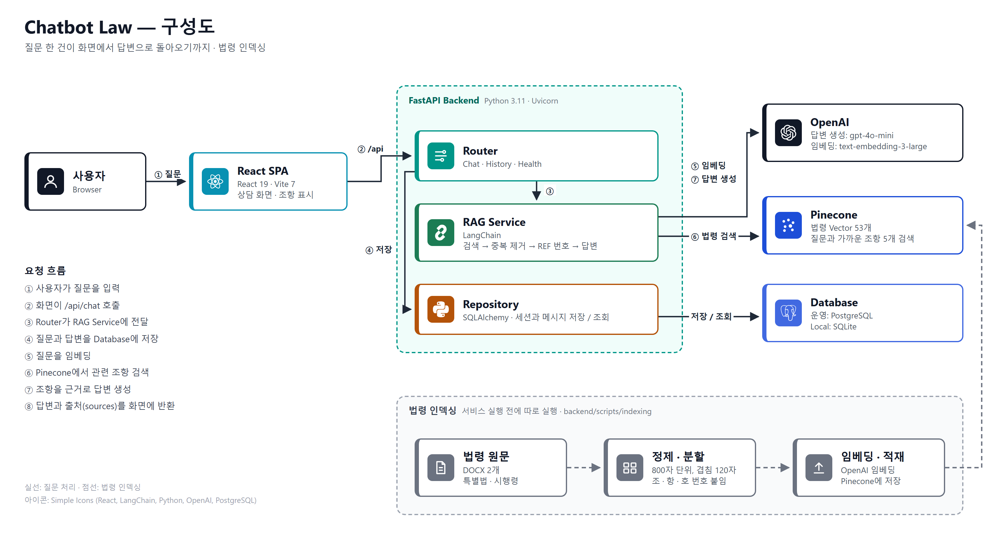
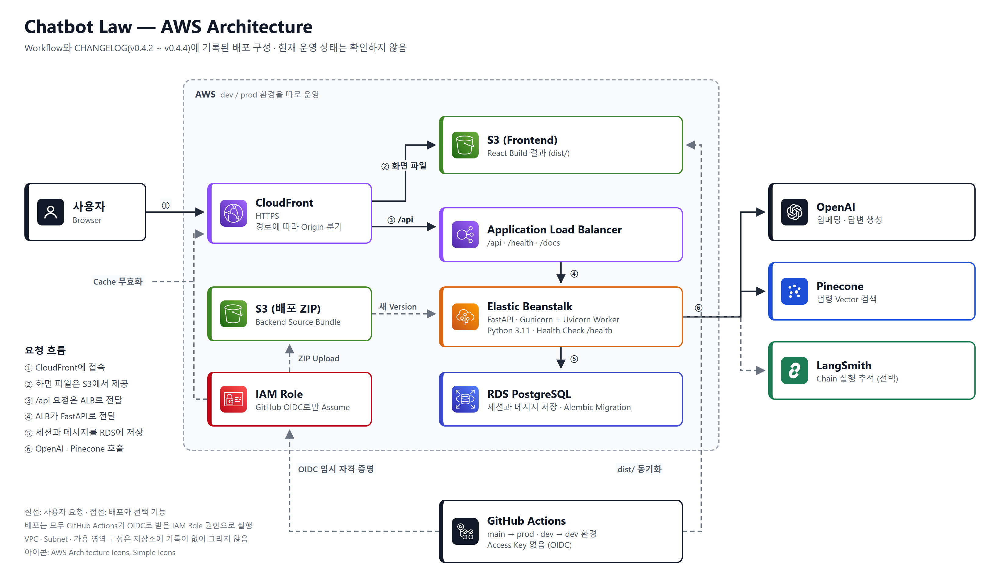

# Chatbot Law Production

**전세사기 피해자를 위한 법률·행정 절차 안내 AI 서비스입니다.**

사용자가 질문을 입력하면 관련 법령 조항을 검색하고, 그 조항을 근거로 절차와 기관 정보를 대화형 답변으로 제공합니다.
답변의 문장 끝에는 근거가 된 조항을 `[전세사기피해자법 제6조 제1항]`처럼 표시합니다.


> 이 서비스는 공인된 법률 자문이나 법적 대리 행위를 제공하지 않습니다. 실제 사건은 대한법률구조공단, 전세피해지원센터 또는 전문 변호사와 상담해야 합니다.

| | |
|---|---|
| 화면 | 상담 화면, 추천 질문, 세션별 대화 이력 |
| 데이터 | 전세사기피해자 지원 및 주거안정에 관한 특별법과 같은 법 시행령 원문 |
| 모델 | OpenAI `gpt-4o-mini`(답변) / `text-embedding-3-large`(임베딩) |
| 검색 | Pinecone Vector Store, 질문마다 관련 조항 5개 |
| 배포 | AWS(S3, CloudFront, Elastic Beanstalk, RDS) + GitHub Actions CI / CD |

**더 읽기**: [Wiki](https://github.com/youneedpython/chatbot-law-production/wiki) · [사용 영상](#사용-영상) · [Releases](https://github.com/youneedpython/chatbot-law-production/releases) · [CHANGELOG.md](CHANGELOG.md)

Wiki에는 **어떻게 만들었고 왜 그렇게 정했는지**를 적었습니다: 
- [핵심 로직](https://github.com/youneedpython/chatbot-law-production/wiki/핵심-로직)
- [Architecture](https://github.com/youneedpython/chatbot-law-production/wiki/Architecture)
- [배포와 CI CD](https://github.com/youneedpython/chatbot-law-production/wiki/배포와-CI-CD)
- [Local 실행](https://github.com/youneedpython/chatbot-law-production/wiki/Local-실행)
- [Roadmap과 한계](https://github.com/youneedpython/chatbot-law-production/wiki/Roadmap과-한계)

---

## 사용 영상

Local 환경에서 Pinecone Index `chatbot-law-prod`에 연결해 2026-10-06에 녹화했습니다.

**PC (35초)** — 초기 화면 → 추천 질문 선택 → 답변과 조항 인용 → 이어서 질문 입력 → 답변 복사

https://github.com/user-attachments/assets/b95a4a66-b910-4341-9602-f5a8283ca49a

**모바일 (34초)** — 같은 흐름을 390px 화면에서

https://github.com/user-attachments/assets/cb9309e0-e147-4b78-bd01-c5f89ed2d067

---

## 주요 기능

### 1. 법령을 근거로 한 답변

- 질문과 가까운 법령 조항 5개를 검색하고, 그 내용을 근거로 답변을 만듭니다.
- 검색 대상은 저장소의 법령 원문 2개(특별법, 시행령)입니다. 다른 법령은 검색하지 않습니다.
- 근거가 부족한 내용은 답하지 않도록 지시하지만, 모델이 항상 지키지는 않습니다.
- 자세한 내용: [핵심 로직](https://github.com/youneedpython/chatbot-law-production/wiki/핵심-로직)

### 2. 조항 인용 표시

- 답변 문장 끝의 인용 번호를 법률명과 조항으로 바꿔 보여 줍니다.
- 인용 번호와 API가 돌려주는 출처(`sources`)의 번호가 항상 일치합니다.
- 인용은 모든 답변에 붙지는 않습니다.
- 자세한 내용: [Roadmap과 한계](https://github.com/youneedpython/chatbot-law-production/wiki/Roadmap과-한계)

### 3. 추천 질문과 대화 이력

- 초기 화면의 추천 질문을 누르면 바로 상담을 시작합니다.
- 세션과 메시지를 Database에 저장해, 같은 주소로 다시 들어오면 이어서 상담할 수 있습니다.
- 답변은 버튼 하나로 복사할 수 있습니다.

### 4. 운영을 위한 기본 장치

- 요청마다 `X-Request-ID`를 붙여 Log에서 한 요청을 따라갈 수 있습니다.
- `/health`로 서비스가 살아 있는지 확인합니다.
- 화면(S3, CloudFront)과 API(Elastic Beanstalk)를 따로 배포합니다.

---

## 법률 상담은 어떻게 동작하나요?

| 단계 | 하는 일 |
|---|---|
| 1. 질문 저장 | 사용자 메시지를 세션에 저장 |
| 2. 검색 | 질문을 임베딩해 Pinecone에서 관련 조항 5개 검색 |
| 3. 근거 정리 | 중복 조항을 제거한 뒤 `REF 1`, `REF 2` … 번호 부여 |
| 4. 답변 생성 | 근거 조항 안에서 답변을 만들고, 문장 끝에 `REF` 번호를 인용 |
| 5. 반환 | 답변과 같은 번호의 출처(`sources`)를 함께 반환하고 답변을 저장 |
| 6. 표시 | 화면이 인용 번호를 법률명과 조항으로 바꿔 표시 |

중복 제거를 번호 부여보다 먼저 하므로, 답변의 인용 번호와 출처 목록의 번호가 어긋나지 않습니다.

---

## 구성



| API | 설명 |
|---|---|
| `POST /api/chat/{session_id}` | 질문을 받아 답변과 `sources` 반환 |
| `GET /api/conversations/{session_id}/messages` | 세션의 메시지 조회 |
| `POST /api/conversations/{session_id}/messages` | 세션에 메시지 저장 |
| `GET /health` | 서비스 생존 확인 |

층별 역할과 설계에서 정한 것은 Wiki의 [Architecture](https://github.com/youneedpython/chatbot-law-production/wiki/Architecture)에 있습니다.

## AWS 배포

`main` 또는 `dev`에 Push하면 GitHub Actions가 바뀐 경로에 따라 Backend와 Frontend를 따로 배포합니다.



- **화면**: S3에 올린 Build를 CloudFront가 제공합니다.
- **API**: CloudFront가 `/api` 요청을 Application Load Balancer로 넘기고, Elastic Beanstalk의 FastAPI가 처리합니다.
- **Database**: RDS PostgreSQL에 세션과 메시지를 저장합니다.
- **배포**: GitHub Actions가 OIDC 임시 자격 증명으로 배포합니다. 저장된 Access Key가 없습니다.

> **환경 상태 (2026-10-06)**: 코드에 기록된 CloudFront 주소(`d19b4mxgdd1vkt.cloudfront.net`)는 지금 조회되지 않습니다. 그 밖의 AWS Resource가 남아 있는지는 확인하지 않았습니다.

자세한 내용은 [배포와 CI CD](https://github.com/youneedpython/chatbot-law-production/wiki/배포와-CI-CD)를 참고합니다.

## 기술 스택

| 영역 | 기술 |
|---|---|
| Frontend | React 19, Vite 7, React Router 7, React Markdown 10 |
| Backend | Python 3.11, FastAPI 0.124, Uvicorn |
| RAG | LangChain 1.2, OpenAI, Pinecone |
| Database | SQLAlchemy 2.0, Alembic, PostgreSQL / SQLite(Local) |
| Infrastructure | AWS S3, CloudFront, Elastic Beanstalk, ALB, RDS |
| CI / CD | GitHub Actions (OIDC) |

정확한 Version은 `backend/requirements.txt`와 `frontend/package.json`을 따릅니다.

## 품질 검증

| 검증 | 내용 |
|---|---|
| CI | Pull Request마다 바뀐 경로에 따라 Backend `pytest`, Frontend `npm run build` 실행 |
| Backend Test | `backend/tests/test_smoke.py`의 Smoke Test 하나 |
| Local 실행 확인 | 2026-10-06에 질문, 답변, 조항 인용 표시까지 확인 |

답변 품질을 자동으로 검증하는 Test는 없습니다. 한계는 [Roadmap과 한계](https://github.com/youneedpython/chatbot-law-production/wiki/Roadmap과-한계)에 적었습니다.

---

## 시작하기

실행하려면 Python `3.11`, Node.js `20.19` 이상, OpenAI와 Pinecone의 API Key, 법령이 적재된 Pinecone Index가 필요합니다.
단계별 명령과 환경변수, 자주 만나는 문제는 Wiki의 [Local 실행](https://github.com/youneedpython/chatbot-law-production/wiki/Local-실행)과 [환경 변수](https://github.com/youneedpython/chatbot-law-production/wiki/환경-변수)에 있습니다.

---

## 프로젝트 구조

```text
chatbot-law-production/
├── backend/                 FastAPI
│   ├── app/
│   │   ├── routers/         Chat, History, Health API
│   │   ├── service/         검색, 근거 정리, 답변 생성
│   │   ├── repository/      세션과 메시지 저장 / 조회
│   │   └── core/  models/  schemas/
│   ├── alembic/             DB Migration (PostgreSQL)
│   ├── data/                법령 원문, 인덱싱 기록
│   ├── scripts/indexing/    법령 인덱싱 (분할, 임베딩, Pinecone 적재)
│   └── tests/               Backend Test
├── frontend/                React + Vite
│   └── src/                 상담 화면, API Client
├── docs/images/             README 이미지
├── .github/workflows/       CI, Backend / Frontend 배포
└── CHANGELOG.md             Release별 변경 기록
```
