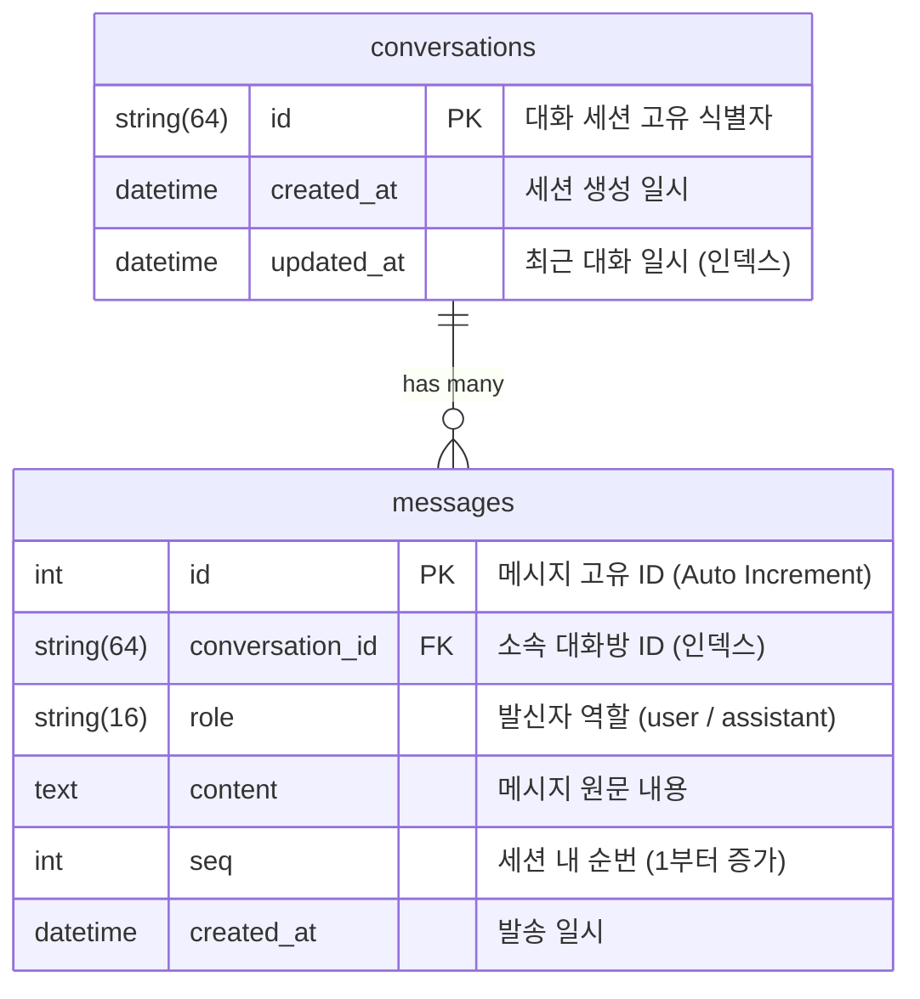

# 🗄️ 데이터베이스 마이그레이션 가이드 (Database Migration)

본 문서는 **Chatbot Law**의 데이터 모델 구조와 **SQLAlchemy + Alembic**을 활용한 스키마 버전 관리 및 마이그레이션 절차를 설명합니다.

---

## 🏗️ 데이터베이스 아키텍처 개요

본 프로젝트는 프로토타입 단계의 로컬 파일 기반 DB(SQLite)에서 출발하여, 운영 환경의 동시성 및 데이터 무결성을 보장하기 위해 **AWS RDS(PostgreSQL)**로 안정적으로 전환되었습니다.

- **ORM**: SQLAlchemy 2.0 스타일 선언형 매핑 (`app/models/`)
- **마이그레이션 도구**: Alembic (`backend/alembic/`)
- **환경 분기**:
  - 로컬/테스트: SQLite (`dev.db` 또는 In-Memory)
  - 개발/운영: AWS RDS PostgreSQL

---

## 📊 테이블 스키마 구조 (Schema Design)

현재 기준선(`v0.5.1`)의 데이터 모델은 대화 세션의 영속성과 메시지 순서 보장에 최적화되어 있습니다.



### 1) `conversations` 테이블
- **`id`** (`String(64)`, PK): 세션 고유 UUID 또는 클라이언트 발급 식별자
- **`created_at`** (`DateTime(timezone=True)`): 세션 최초 시작 시각
- **`updated_at`** (`DateTime(timezone=True)`, 인덱스: `ix_conversations_updated_at`): 최근 질의가 발생한 시각. 목록 정렬 및 오래된 세션 정리에 사용됩니다.

### 2) `messages` 테이블
- **`id`** (`Integer`, PK): 메시지 고유 일련번호
- **`conversation_id`** (`String(64)`, 인덱스): `conversations.id`와 매핑
- **`role`** (`String(16)`): `'user'` (사용자 질의) 또는 `'assistant'` (챗봇 답변)
- **`content`** (`Text`): 실제 대화 텍스트 (RAG 답변 및 앙커 토큰 포함)
- **`seq`** (`Integer`): 동일 세션 내에서의 순차 번호 (1, 2, 3...)
- **`created_at`** (`DateTime(timezone=True)`): 메시지 기록 시각
- **복합 인덱스**: `(conversation_id, seq)` - 특정 세션의 메시지 순차 페이징 조회 속도 극대화

---

## ⚙️ Alembic 설정 구조

- **`backend/alembic.ini`**: Alembic 실행 환경 기본 설정
- **`backend/alembic/env.py`**:
  - `app.core.config.DATABASE_URL`을 동적으로 읽어와 마이그레이션 대상 DB에 연결
  - `app.models.base.Base.metadata`를 타깃 메타데이터로 등록하여 모델 변경 사항을 자동 감지
- **`backend/alembic/versions/`**: 버전별 마이그레이션 스크립트 저장소

---

## 🛠️ 실무 마이그레이션 명령어

모든 Alembic 명령어는 **`backend` 디렉터리**에서 실행해야 합니다.

### 1. 최신 버전으로 스키마 업그레이드
로컬 환경을 처음 세팅하거나, 원격 DB에 신규 변경 사항을 적용할 때 실행합니다:
```bash
cd backend
alembic upgrade head
```

### 2. 모델 변경 후 신규 마이그레이션 생성
`app/models/` 내의 파이썬 모델 클래스를 수정한 뒤, 변경 내역을 바탕으로 마이그레이션 스크립트를 자동 생성합니다:
```bash
alembic revision --autogenerate -m "add_feedback_column_to_messages"
```
> [!IMPORTANT]
> `--autogenerate`로 생성된 파일(`alembic/versions/xxxx_description.py`)은 배포 전 반드시 열어서 의도한 DDL만 포함되었는지 검토해야 합니다.

### 3. 마이그레이션 상태 및 히스토리 확인
```bash
# 현재 적용된 마이그레이션 리비전 확인
alembic current

# 전체 마이그레이션 히스토리 확인
alembic history --verbose
```

### 4. 이전 버전으로 롤백 (Downgrade)
직전 리비전으로 되돌릴 때 사용합니다:
```bash
alembic downgrade -1
```

---

## 🚀 운영 환경(AWS RDS) 배포 시 수칙

1. **무중단 마이그레이션 원칙 (Zero Downtime)**
   - 컬럼을 추가할 때는 기존 버전의 애플리케이션이 오류를 일으키지 않도록 `nullable=True` 또는 적절한 `default` 값을 부여합니다.
   - 컬럼 삭제나 이름 변경은 2단계 배포(새 컬럼 추가 및 데이터 동기화 → 구 컬럼 참조 제거 → 구 컬럼 삭제)를 거칩니다.
2. **사전 백업**
   - 프로덕션 DB에 `alembic upgrade head`를 실행하기 전 AWS RDS 스냅샷을 생성합니다.
3. **배포 단계**
   - CI/CD 파이프라인에서 컨테이너/인스턴스가 교체되기 전 별도의 마이그레이션 스텝 또는 관리자 진입 세션에서 마이그레이션을 선행 완료합니다.
