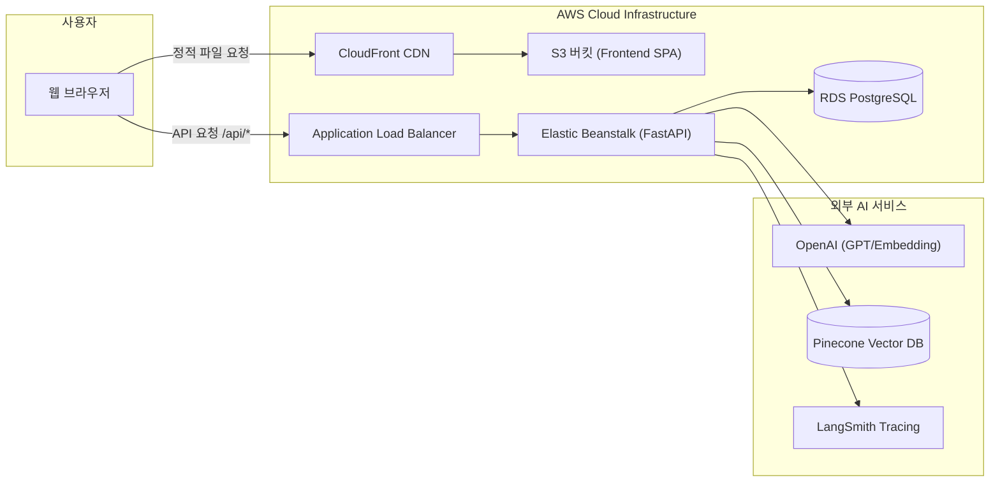

# ☁️ 클라우드 배포 파이프라인 (Deployment)

본 문서는 **Chatbot Law – Production**의 AWS 클라우드 인프라 아키텍처와 **GitHub Actions + AWS OIDC** 기반의 무중단 CI/CD 배포 파이프라인을 설명합니다.

---

## 🏛️ 클라우드 인프라 구조 (Cloud Architecture)

본 서비스는 정적 웹 리소스와 동적 API의 워크로드를 철저히 분리하여 높은 보안성과 비용 효율성을 확보했습니다.



- **Frontend**: Amazon S3 (Static Website Hosting) + Amazon CloudFront (글로벌 엣지 캐싱, HTTPS SSL/TLS)
- **Backend**: AWS Elastic Beanstalk (Python 3.11 플랫폼, ALB 로드밸런싱, Auto-Scaling 지원)
- **Database**: Amazon RDS (PostgreSQL 15+)
- **CI/CD**: GitHub Actions (AWS OIDC 기반 토큰 인증)

---

## 🛡️ 무자격증명 보안 인증 (AWS OIDC)

장기 IAM Access Key를 GitHub Secrets에 보관하는 보안 취약점을 방지하기 위해 **OpenID Connect (OIDC)** 방식을 채택했습니다.

1. GitHub Actions 러너가 실행될 때 GitHub의 OIDC Provider로부터 단기 JWT 토큰을 발급받습니다.
2. `aws-actions/configure-aws-credentials`를 통해 AWS STS(Security Token Service)로 해당 토큰을 검증하고 사전에 지정된 IAM Role(`AWS_ROLE_ARN`)을 Assume 합니다.
3. 배포가 완료되면 단기 세션 자격 증명이 자동으로 만료됩니다.

---

## 🚀 GitHub Actions 배포 파이프라인

`.github/workflows/` 디렉터리에 정의된 워크플로우를 통해 변경 사항이 감지되면 자동으로 배포가 진행됩니다.

### 1) 백엔드 자동 배포 (`deploy-backend-eb.yml`)
- **트리거**: `main`(운영) 또는 `dev`(개발) 브랜치에 `backend/**` 경로 파일이 push될 때
- **주요 실행 단계**:
  1. 저장소 체크아웃 및 AWS OIDC 자격 증명 설정
  2. `backend/` 디렉터리만을 아티팩트로 압축 (`backend-<branch>-<sha>.zip`)
  3. 배포용 S3 버킷(`S3_BUCKET`)으로 ZIP 파일 업로드
  4. Elastic Beanstalk 신규 애플리케이션 버전 등록:
     ```bash
     aws elasticbeanstalk create-application-version \
       --application-name $EB_APP_NAME \
       --version-label $ZIP_NAME \
       --source-bundle S3Bucket=$S3_BUCKET,S3Key=$ZIP_NAME
     ```
  5. Elastic Beanstalk 환경 업데이트 및 롤링 배포 수행:
     ```bash
     aws elasticbeanstalk update-environment \
       --environment-name $EB_ENV_NAME \
       --version-label $ZIP_NAME
     ```

### 2) 프론트엔드 자동 배포 (`deploy-frontend-prod.yml`)
- **트리거**: `main` 브랜치에 `frontend/**` 경로 파일이 push될 때
- **주요 실행 단계**:
  1. Node.js 20 환경 구성 및 의존성 캐시 설치 (`npm ci`)
  2. Vite 환경 변수(`VITE_API_BASE_URL=/api`, `VITE_APP_ENV=prod`) 주입 후 프로덕션 빌드 (`npm run build`)
  3. S3 버킷으로 빌드 산출물(`dist/`) 동기화 (`aws s3 sync dist s3://$FRONT_S3_BUCKET --delete`)
  4. CloudFront 캐시 무효화 (`aws cloudfront create-invalidation --distribution-id $CLOUDFRONT_DISTRIBUTION_ID --paths "/*"`)

### 3) 풀 리퀘스트 사전 검증 (`ci-pr-check.yml`)
- PR 생성 및 업데이트 시 백엔드 테스트(`pytest`)와 프론트엔드 빌드 검증을 선행하여 안정성이 입증된 코드만 병합되도록 강제합니다.

---

## ⚙️ Elastic Beanstalk 서버 런타임 설정

### 1) 애플리케이션 실행 프로세스 (`backend/Procfile`)
운영 환경에서는 Uvicorn 워커를 기반으로 한 Gunicorn 프로세스 관리자를 실행합니다:
```bash
web: gunicorn app.main:app -k uvicorn.workers.UvicornWorker -b 0.0.0.0:8000 --workers 1 --timeout 60 --graceful-timeout 30 --keep-alive 5 --access-logfile - --error-logfile -
```

### 2) 로드밸런서 헬스체크 (`backend/.ebextensions/01_healthcheck.config`)
Application Load Balancer가 인스턴스의 프로세스 상태를 주기적으로 감시하도록 `/health` 엔드포인트를 지정합니다:
```yaml
option_settings:
  aws:elasticbeanstalk:application:
    Application Healthcheck URL: /health
```

---

## 🔄 롤백 및 모니터링 가이드

1. **즉각 롤백 (Instant Rollback)**
   - 장애 발생 시 AWS Management Console의 Elastic Beanstalk > **Application Versions** 메뉴에서 이전 정상 버전 라벨을 선택한 뒤 **Deploy**를 클릭하면 수초 내에 이전 코드로 롤백됩니다.
2. **로그 모니터링**
   - CloudWatch Logs 또는 EB 콘솔의 **Logs** 메뉴에서 `gunicorn` 에러 로그 및 FastAPI의 `X-Request-ID`가 포함된 액세스 로그를 실시간으로 확인하실 수 있습니다.
